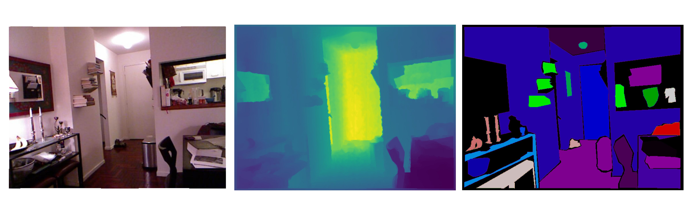

# Datasets in AP4FED

<p align="center">

</p>

<tt>AP4FED<tt> provides a carefully curated selection of popular and diverse datasets for federated learning research and experimentation. Each dataset has been preprocessed and organized to facilitate seamless integration with federated learning workflows.

## Available Datasets

### CIFAR-10
**Overview**: CIFAR-10 is a widely-used benchmark dataset consisting of 60,000 32x32 color images across 10 different classes.

**Key Features**:
- 50,000 training images, 10,000 test images
- 10 classes: airplane, automobile, bird, cat, deer, dog, frog, horse, ship, truck
- RGB images of size 32x32 pixels
- Balanced classes with 6,000 images per class

**Usage in Federated Learning**:
- Ideal for simulating heterogeneous data distribution scenarios
- Commonly used for evaluating model performance in non-IID settings
- Supports both client-level and sample-level partitioning strategies

### Fashion-MNIST (FMNIST)
**Overview**: A modern alternative to MNIST, consisting of 70,000 grayscale images of fashion items from 10 categories.

**Key Features**:
- 60,000 training images, 10,000 test images
- 10 classes of fashion items: t-shirt/top, trouser, pullover, dress, coat, sandal, shirt, sneaker, bag, ankle boot
- Grayscale images of size 28x28 pixels
- Clean, preprocessed dataset requiring minimal additional processing

**Usage in Federated Learning**:
- Perfect for benchmarking federated learning algorithms
- Suitable for studying model convergence in distributed settings
- Enables realistic simulation of real-world fashion retail scenarios

### NYUv2 (NYU Depth Dataset V2)
**Overview**: A large-scale RGB-D dataset containing indoor scenes captured using Microsoft Kinect.

<p align="center">

</p>

**Key Features**:
- Over 400,000 RGB-D images
- 1449 densely labeled pairs of aligned RGB and depth images
- 894 different indoor scenes
- Rich semantic segmentation annotations
- Dense depth maps

**Applications**:
- Indoor scene understanding
- Depth estimation
- Semantic segmentation
- Multi-task federated learning

### iv4N 
**Overview**: A synthetic multi-task computer vision dataset generator designed to create controlled scenarios for federated learning research. It generates paired RGB images, semantic labels, and depth maps with configurable distributions.

<p align="center">

</p>

**Key Features**:
- Multi-modal output: RGB images, semantic segmentation labels, and depth maps
- Configurable image generation parameters:
  - Image size: 16×16 to 256×256 pixels
  - Number of classes: 2-10 distinct segments
  - Dataset size: Up to 100,000 images
  - Foreground ratio: 0.5-1.0 adjustable coverage
  - Distribution control via Dirichlet parameter (α: 0.1-5.0)
- Geometric primitive shapes (circles, rectangles, triangles) with random RGB colors
- Controlled class distribution using Dirichlet distribution
- Depth information with random values (50-255) per segment

**Generated Data Structure**:
```
data/
├── rgb_images/      # RGB images with random shapes
├── labels/          # Semantic segmentation masks
├── depth_maps/      # Depth information per segment
└── labels_npy/      # NumPy format segmentation masks
```

**Use Cases**:
- Multi-task federated learning research
- Non-IID data distribution studies
- Multi-modal learning experiments
- Controlled environment for federated learning algorithms
- Benchmarking segmentation and depth estimation tasks


## Data Distribution Strategies

AP4FED supports various data distribution strategies for federated learning:

1. **IID Distribution**: Random distribution of data across clients.
2. **Non-IID Distribution**: Skewed distribution of classes across clients.
3. **Random**: Randomly selection between IID and non-IID distribution.
